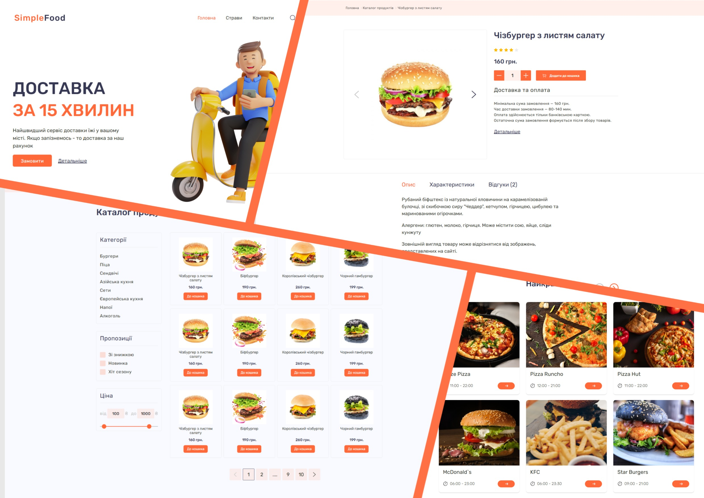
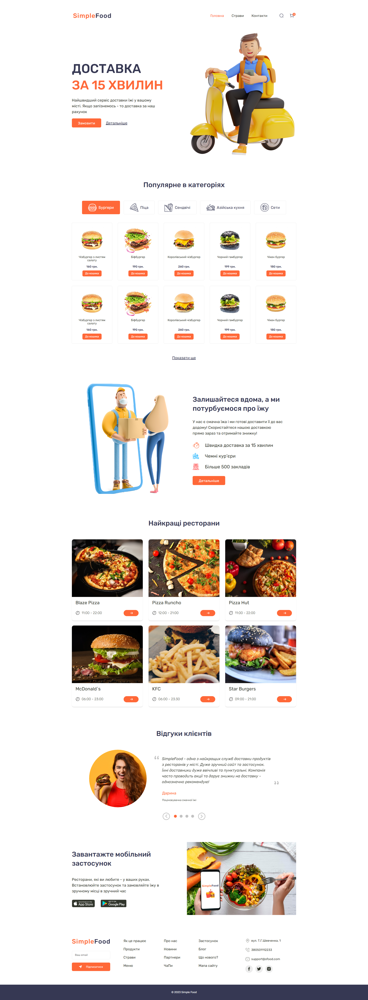
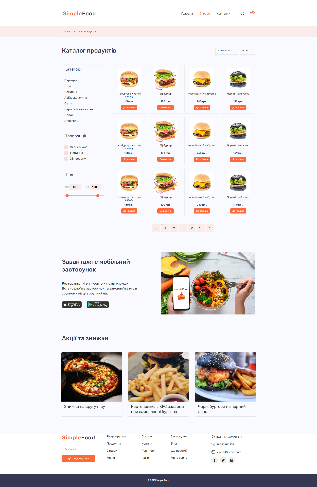
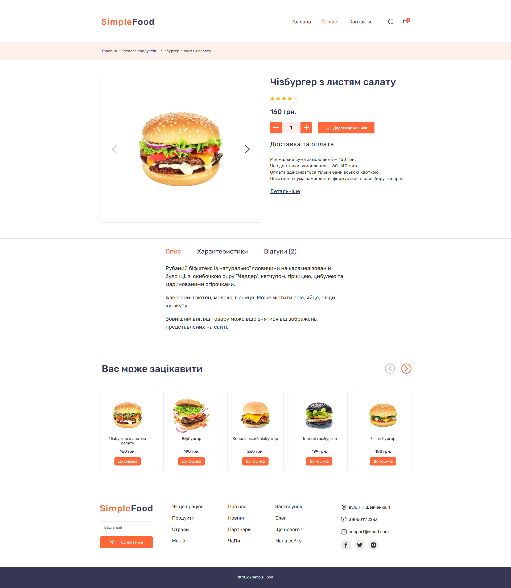

# 🍔 Simple Food

A graduation project built in **2025** for the **[From 0 to 1](https://from0to1.com.ua/)** course by **Vadim Prokopchuk**.

## 🚀 Live Demo

👉 [https://sfood-umber.vercel.app/](https://sfood-umber.vercel.app/)

## ✨ Features

- Responsive layout
- Product catalog
- Product details page
- Clean and modern UI
- TAB navigation

## 🛠️ Tech Stack

- HTML
- SCSS
- JS (Vanilla)
- Gulp

## 📚 About

This project was created as the final assignment for the **From 0 to 1** course. During development, the project went through code reviews, helping improve code quality and overall development practices.

## 📸 Screenshots

### Home

### Catalog

### Product

